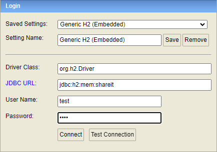

# java-shareit
Template repository for Shareit project.

Приложение использует базу данных h2, которая находится в памяти.

Чтобы получить досуп к БД:
* Запустить приложение.
* Перейти по ссылке: http://localhost:8080/h2-console/
* Ввести данные как указанно на картинке
* 
> Поле логина и пароля идентичны и равны значению "test"
* Нажать на кнопку "Connect"
